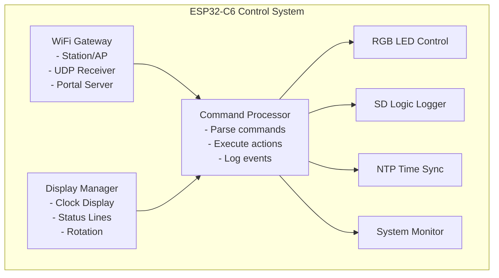
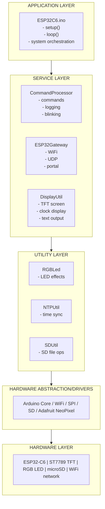
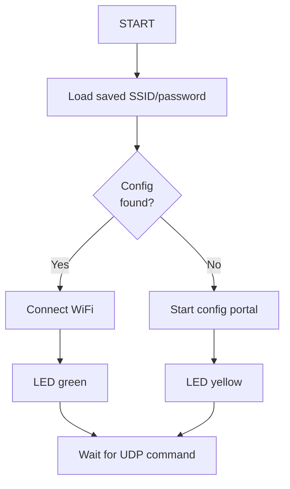
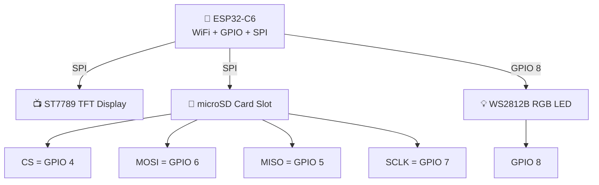
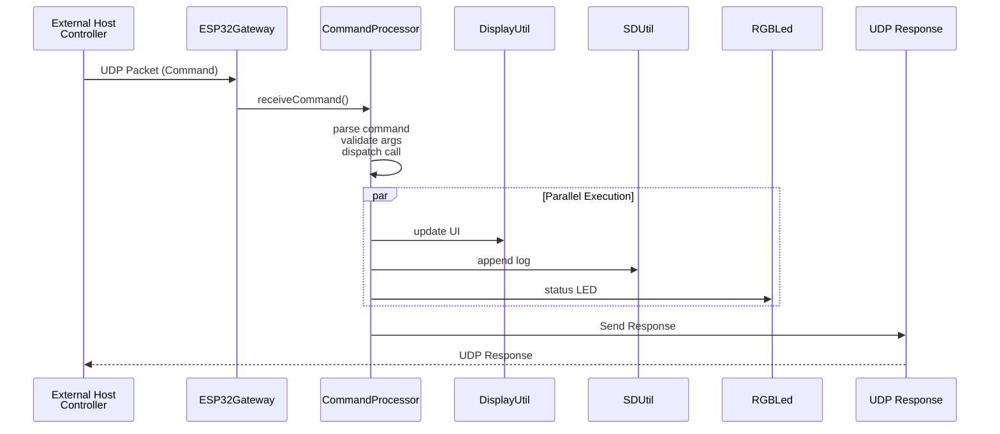
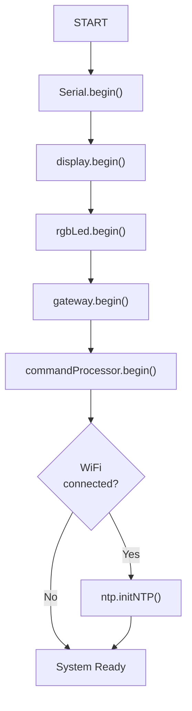
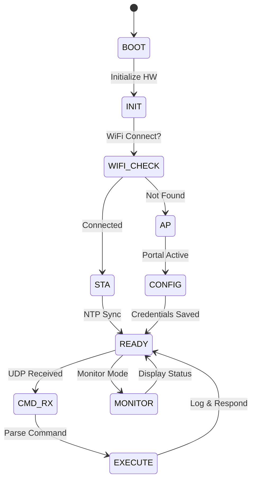
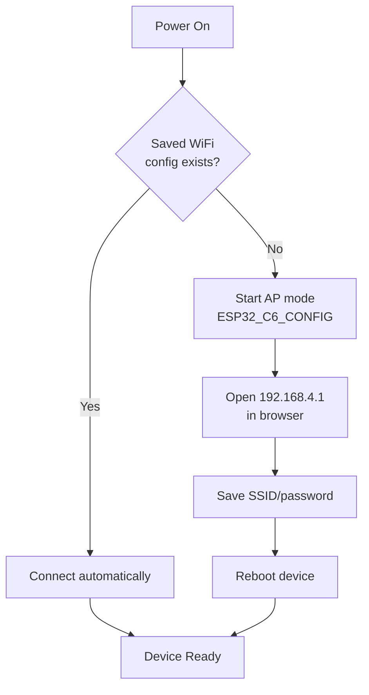
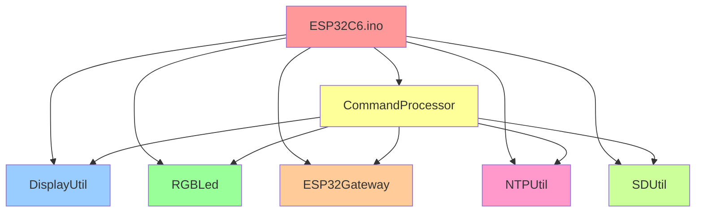

# ESP32-C6 IoT Gateway & Control System

<div align="center">


**A professional-grade IoT gateway system for the ESP32-C6 microcontroller with WiFi connectivity, real-time display, SD card logging, and comprehensive command processing.**

</div>

---

## Table of Contents

- [Overview](#overview)
- [Project Architecture](#project-architecture)
- [System Components](#system-components)
- [Hardware Schematic](#hardware-schematic)
- [Data Flow Diagram](#data-flow-diagram)
- [System State Machine](#system-state-machine)
- [Command Reference](#command-reference)
- [Installation & Setup](#installation--setup)
- [Configuration](#configuration)
- [Development](#development)
- [File Structure](#file-structure)
- [API Reference](#api-reference)

---

## Overview

The ESP32-C6 IoT Gateway & Control System is a sophisticated embedded application designed to provide:

- WiFi Connectivity: Station and Access Point modes
- Remote Command Processing: UDP-based command interface
- Real-Time Display: ST7789 display with rotation support
- LED Feedback: WS2812B RGB LED with breathing and blinking effects
- Data Logging: SD card-based persistent logging
- Network Synchronization: NTP for accurate time synchronization
- System Monitoring: Real-time CPU, RAM, and Flash metrics

### Key Features

- Automatic WiFi connection with fallback to configuration portal
- UDP command reception and processing
- HTML-based WiFi configuration interface
- Comprehensive system diagnostics
- SD card file management and logging
- RGB LED status indication
- Clock display with date and time
- Advanced command parsing with parameter validation

---

## Project Architecture

### High-Level Architecture Diagram



### Layered Architecture



---

## System Components

### 1. ESP32C6.ino - Main Application
The central sketch file that initializes all subsystems and runs the loop.

Responsibilities:
- Initialize serial output
- Initialize display, LED, gateway, SD, command processor
- Process received UDP commands
- Maintain system loop and clock display mode

### 2. ESP32Gateway - Network & Connectivity
This module handles:
- WiFi connection in Station mode
- WiFi Access Point mode when no credentials are stored
- UDP packet reception on port 4210
- Web server for WiFi configuration portal
- Memory persistence using Preferences

Flow:



### 3. CommandProcessor - Command Execution Engine
This class processes received commands and dispatches actions.

Example supported commands:
- `LED_ON`
- `LED_OFF`
- `LED_PISCA:10:250`
- `LED_BLINK:500`
- `CPU`
- `RAM`
- `FLASH`
- `TIME`
- `NET_INFO`
- `LIST`
- `READ:/log.txt`
- `DEL:/file.txt`
- `RESET_WIFI`

### 4. DisplayUtil - TFT Display Controller
Responsibilities:
- ST7789 display initialization
- Output text to screen
- Rotation management
- Clock display mode
- Text history and redraw support

### 5. RGBLed - Visual Status Indicator
The RGB LED provides system feedback:
- Blue: trying to connect to WiFi
- Yellow: configuration portal active
- Green: connected successfully
- White: command output / active state
- Breathing / blinking: advanced status indicators

### 6. NTPUtil - Time Synchronization
Handles NTP time retrieval and formatted timestamps for logs and display.

### 7. SDUtil - Persistent Storage
Provides microSD card management such as:
- begin() and card health checks
- file read/write/append
- directory listing
- SD size and type detection
- log persistence in `/log.txt`

---

## Hardware Schematic

### Proposed System Wiring



### Pin Mapping Summary

| Component | Pin | GPIO |
|-----------|-----|------|
| **SD Card** | CS | GPIO 4 |
| | MISO | GPIO 5 |
| | MOSI | GPIO 6 |
| | SCLK | GPIO 7 |
| **RGB LED** | DATA | GPIO 8 |
| **Display** | SPI | Board-specific |

---

## Data Flow Diagram

### Runtime Data Flow



### Initialization Data Flow



---

## System State Machine



---

## Command Reference

### LED Commands

| Command | Description |
|---------|-------------|
| `LED_ON` | Turns the status LED on in white |
| `LED_OFF` | Turns the status LED off |
| `LED_PISCA:x:y` | Blink LED `x` times with interval `y` ms |
| `LED_BLINK:y` | Continuous blink with interval `y` ms |

Examples:
- `LED_PISCA:10:250`
- `LED_BLINK:500`

### System Commands

| Command | Description |
|---------|-------------|
| `CPU` | Returns CPU model, revision, and cores |
| `RAM` | Returns free heap and memory stats |
| `FLASH` | Returns flash memory size and stats |
| `INIT` | Returns reset reason |
| `UPTIME` | Returns device uptime |
| `MAC` | Returns MAC address |
| `NET_INFO` | Returns IP, gateway, mask, RSSI and SSID |
| `TIME` | Returns current date/time |

### SD Commands

| Command | Description |
|---------|-------------|
| `LIST` | List files in the SD root |
| `SD_TYPE` | Get SD card type |
| `SD_SIZE` | Get SD size in bytes |
| `SD_TEST` | Perform card test |
| `READ:/path/file.txt` | Read file from SD |
| `DEL:/path/file.txt` | Delete specified file |

### Configuration Commands

| Command | Description |
|---------|-------------|
| `RESET_WIFI` | Clears saved WiFi info and restarts |

---

## Installation & Setup

### Requirements

- ESP32-C6 development board
- Arduino IDE or VS Code + PlatformIO
- ST7789 display
- microSD card module or socket
- WS2812B RGB LED
- USB cable

### Arduino IDE Setup

1. Install the ESP32 board package
2. Select your board (`ESP32-C6` or compatible)
3. Install required libraries:
   - Arduino_GFX_Library
   - Adafruit_NeoPixel
   - SD
4. Open `ESP32C6.ino`
5. Compile and upload

### Required Libraries

- Adafruit NeoPixel
- Arduino_GFX_Library
- SD
- WiFi
- SPI

---

## Configuration

### WiFi Setup Flow



### Portal HTML Form

The built-in portal is minimal and functional:
- SSID field
- Password field
- Save button

### NTP / Logging Configuration

- Logs are stored on SD under `/log.txt`
- Time is added to each log entry using NTP synchronization
- If NTP is unavailable, log entries are tagged as `Sem Hora Sinc.`

---

## Development

### File Structure

```
esp32C6/
├── ESP32C6.ino
├── CommandProcessor.h
├── CommandProcessor.cpp
├── ESP32Gateway.h
├── ESP32Gateway.cpp
├── DisplayUtil.h
├── DisplayUtil.cpp
├── RGBLed.h
├── RGBLed.cpp
├── NTPUtil.h
├── NTPUtil.cpp
├── SDUtil.h
├── SDUtil.cpp
├── README.md
└── LICENSE (optional)
```

### Class Relationship



---

## File Structure

### `ESP32C6.ino`
Main orchestrator. Initializes hardware and processes commands in the loop.

### `ESP32Gateway.*`
WiFi, configuration portal, UDP communication, and persistent storage.

### `CommandProcessor.*`
Handles command parsing, validation, logging, and system response generation.

### `DisplayUtil.*`
Controls the ST7789 display, text rendering, clock display, and rotation.

### `RGBLed.*`
Controls the RGB LED visual state feedback and effects.

### `NTPUtil.*`
Syncs the device clock using the NTP protocol.

### `SDUtil.*`
Implements microSD operations like reading, writing, deleting, and listing files.

---

## API Reference

### UDP Receive Interface

```cpp
bool ESP32Gateway::receiveCommand(String& comando)
```
This method reads a UDP packet from the configured port and returns the command string.

### Command Processing

```cpp
void CommandProcessor::executeCommand(String command)
```
This is the central command dispatcher for all supported actions.

### Response Mechanism

```cpp
void CommandProcessor::answerAll(String message, bool log = true)
```
Sends the message to:
- Serial monitor
- Display
- UDP response client
- SD log file when log is enabled

---

## Troubleshooting

### Problem: WiFi does not connect
Possible causes:
- stored SSID/password invalid
- weak signal
- device not in range

Fix:
- clear WiFi config with `RESET_WIFI`
- reconnect to the AP and configure again

### Problem: SD card not detected
Possible causes:
- card not properly seated
- wrong SPI pin wiring
- card is corrupted or not formatted

Fix:
- inspect wiring
- run `SD_TEST`
- format the card as FAT32

### Problem: No response to commands
Possible causes:
- wrong UDP port
- IP address mismatch
- firewall or network issue

Fix:
- check the device IP using `NET_INFO`
- send to port 4210
- confirm device is reachable on the LAN

### Problem: Display shows nothing
Possible causes:
- incorrect display power wiring
- SPI pins mismatched
- initialization issue

Fix:
- verify display wiring
- ensure proper board compatibility
- restart the device

---

## Notes

This project is intentionally designed for embedded experimentation and device automation. It demonstrates strong practices in modularization, connectivity, visual feedback, and logging.

---

<div align="center">

<strong>ESP32-C6 IoT Gateway Project</strong>

</div>
